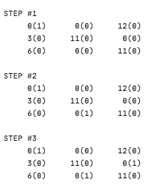

# HungarianAlgorithm
### Introduction
The Hungarian algorithm is used in various areas of planning. In order to make it easier to understand the problem and the principles of the algorithm, I propose to focus on the following example: at the enterprise, the column is the workers, and the row is their salary in the specified position. Thanks to this algorithm, it is possible to be and efficiently assign an employee to the required position in order to receive benefits.

### Steps
 ​
 
This screenshot shows a 4 x 4 matrix. It has been randomly generated, but the dimension has been selected by the user. 

 ​
 
The essence of this algorithm is as follows. First, we find the smallest value in each column and subtract it from the values in the column. Afterwards, do the same with the rows. 

 ​
 
The next step is to select the zero of each column and only one. It is possible that for some values we cannot select zero because this row is not free, so we must specify this zero.

Now we need to find matches and mark which columns are used.Columns and rows form some structure of used elements, we need to find the minimum elements among the unused elements, subtract them from each unused element and add them to the elements that are at the intersection of the used columns and rows.
After that, we can repeat the previous step one more time.

Having carried out these steps, we now have an answer to the above example of a business. 

 ​
